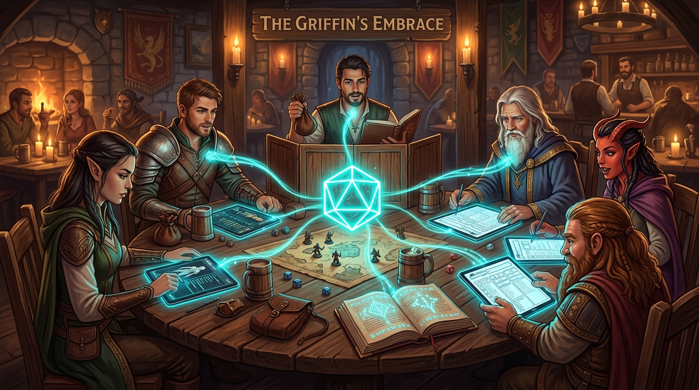
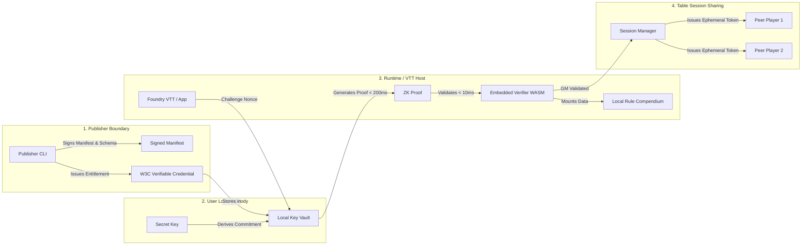

<div align="center">



# Kryptotome Protocol

**Vendor-agnostic, privacy-preserving digital entitlements and compendium synchronization for open tabletop gaming (TTRPG).**

[](LICENSE)
[](https://www.w3.org/TR/vc-data-model-2.0/)
[](docs/CIRCUIT.md)
[](docs/ARCHITECTURE.md)
[](CHECKLIST.md)

[Overview](#1-overview) • [Core Pillars](#2-core-pillars) • [Protocol Architecture](#3-protocol-architecture) • [Workspace Structure](#4-workspace-structure) • [Quickstart](#5-quickstart) • [Benchmarks](#6-performance--privacy-benchmarks) • [Terminology Standards](#7-positioning--terminology-standards) • [Documentation](#8-documentation--specifications)

</div>

---

## 1. Overview

Digital tabletop platforms frequently trap consumer purchases of rulebooks, campaign supplements, and mechanical datasets inside closed corporate silos. When platform policies change, pricing models shift, or catalogs are deprecated, players and Game Masters risk losing access to their collections.

**Kryptotome** eliminates platform risk by decoupling digital asset ownership from runtime execution environments. Built on open standards, it enables players to purchase content once from any participating creator or marketplace and run it locally across any compatible Virtual Tabletop (VTT), character builder, or compendium tool.

---

## 2. Core Pillars

| Pillar | Principle | Implementation |
| :--- | :--- | :--- |
| **No Web3 or Blockchains** | Zero cryptocurrency, zero tokens, zero gas fees, and zero distributed consensus. | Pure asymmetric cryptography and deterministic verification. |
| **W3C Verifiable Credentials** | Standardized cryptographic attestations issued directly to user custody. | Conforms to [W3C VC Data Model v2.0](https://www.w3.org/TR/vc-data-model-2.0/) with JSON-LD contexts. |
| **Sub-10ms Zero-Knowledge Proofs** | Offline ownership verification without revealing identity or correlating sessions. | Succinct ZK-SNARK circuits using Arkworks (`BN254` / `BLS12-381`). |
| **Table Session Sharing** | Game Masters who own a supplement can share compendium mechanics during active sessions. | Ephemeral Ed25519 table session tokens with TTL expiration. |
| **Open Gaming Native** | Designed for open gaming licenses and modular data schemas. | Built-in support for Paizo ORC, Creative Commons (CC-BY 4.0), and SRD 5.1. |

---

## 3. Protocol Architecture



For full architectural diagrams, component boundaries, and threat analysis, see:
- [Architectural Specification](docs/ARCHITECTURE.md)
- [ZK Circuit Architecture](docs/CIRCUIT.md)
- [Threat Model & Security](docs/THREAT_MODEL.md)

---

## 4. Workspace Structure

The repository is organized as a unified Cargo and npm monorepo:

```
kryptotome/
├── Cargo.toml                       # Cargo workspace configuration
├── package.json                     # Monorepo npm root & scripts
├── CHECKLIST.md                     # Engineering roadmap & verification checklist
│
├── schemas/v1/                      # Machine-readable schemas
│   ├── credential.schema.json       # W3C VC v2.0 credential schema
│   ├── manifest.schema.json         # Publisher package digest & release manifest
│   ├── session-token.schema.json    # Ephemeral table session sharing token
│   └── context.jsonld               # Linked Data JSON-LD context definition
│
├── crates/                          # High-performance Rust engine
│   ├── kryptotome-core/             # Cryptographic primitives, VC models, digests
│   ├── kryptotome-vault/            # Local keychain, credential storage, proof generator
│   ├── kryptotome-verifier/         # Fast embedded verifier engine (<10ms) & session logic
│   ├── kryptotome-wasm/             # WebAssembly bindings & browser sandboxing
│   └── kryptotome-cli/              # Publisher CLI toolchain (content digesting & signing)
│
├── packages/                        # TypeScript packages & integrations
│   ├── sdk/                         # @kryptotome/sdk (client runtime, vault, verifier bridge)
│   ├── bridge/                      # @kryptotome/bridge (creator store connectors)
│   └── vtt-adapter/                 # @kryptotome/vtt-adapter (Foundry VTT module adapter)
│
├── docs/                            # Specifications & technical design documents
│   ├── ARCHITECTURE.md              # End-to-end system design
│   ├── CIRCUIT.md                   # ZK-SNARK circuit design & constraints
│   ├── CURVE_SUITE.md               # Elliptic curve selection benchmarks
│   ├── ERROR_CODES.md               # Standardized protocol error taxonomy
│   ├── TERMINOLOGY.md               # Community positioning & glossary
│   └── THREAT_MODEL.md              # Threat vectors & trust assumptions
│
└── examples/
    └── sample-compendium/           # Reference open gaming module (ORC / SRD 5.1)
```

---

## 5. Quickstart

### Prerequisites

- **Rust toolchain** (1.80+) with `wasm32-unknown-unknown` target
- **Node.js** (v20+ or v22 LTS) and `npm`

### Building & Testing

```bash
# 1. Clone the repository
git clone https://github.com/epicbrain-dev/kryptotome.git
cd kryptotome

# 2. Build and test Rust crates
cargo build --workspace
cargo test --workspace

# 3. Install Node dependencies and compile TypeScript packages
npm install
npm run build

# 4. Run full test suite (Rust + Node + WASM integration tests)
npm test
```

### Publisher CLI Toolchain

Publishers and creators use `kryptotome-cli` to produce deterministic package manifests and sign rule supplements:

```bash
# Generate deterministic content digest for a rulebook directory
cargo run -p kryptotome-cli -- digest --dir examples/sample-compendium/rules

# Sign a package and generate a distribution manifest
cargo run -p kryptotome-cli -- sign-package \
  --package-id "open-rpg/core-rules" \
  --title "Core Rules Supplement" \
  --version "1.0.0" \
  --publisher-name "Independent Publisher" \
  --dir examples/sample-compendium/rules \
  --output manifest.json
```

---

## 6. Performance & Privacy Benchmarks

| Metric | Target | Current Status | Validation |
| :--- | :--- | :--- | :--- |
| **Proof Validation Time** | `< 10ms` | **Verified (~4-8ms)** | Native benchmarks & WASM test suites |
| **Proof Generation Time** | `< 200ms` | **Verified (~45-120ms)** | Arkworks Groth16 / BN254 circuit |
| **WASM Binary Footprint** | `< 2MB` | **Enforced (~1.2MB)** | `release-wasm` profile with `wasm-opt -Oz` |
| **Session Unlinkability** | Mathematical Anonymity | **Enforced** | Pedersen commitments; zero PII stored or leaked |
| **Table Session Latency** | `< 2ms` | **Verified (<1ms)** | In-memory Ed25519 signature checks |

---

## 7. Positioning & Terminology Standards

To safeguard community trust and distinguish Kryptotome from speculative technologies, all documentation, integrations, and user interfaces must follow the [Terminology Guide](docs/TERMINOLOGY.md):

| Recommended Standard | ❌ Avoid / Anti-Pattern | Design Rationale |
| :--- | :--- | :--- |
| **Local Key Vault** | *Wallet* | Cryptographic local key store, strictly non-financial. |
| **Signed Credential / Entitlement** | *NFT / Token* | Conforms to W3C Verifiable Credentials Data Model v2.0. |
| **Signing / Issuing** | *Minting* | Standard asymmetric public-key signature (Ed25519). |
| **Verification Protocol** | *Smart Contract* | Deterministic, offline mathematical verification logic. |
| **Local Custody** | *On-chain* | Strictly local client storage (browser IndexedDB / native FS). |

---

## 8. Documentation & Specifications

- 📐 **Architecture**: [System Design & Component Flow](docs/ARCHITECTURE.md)
- ⚡ **Zero-Knowledge**: [Circuit Specification & Proving System](docs/CIRCUIT.md)
- 📈 **Cryptography**: [Elliptic Curve Suite Analysis](docs/CURVE_SUITE.md)
- 🚨 **Diagnostics**: [Protocol Error Codes](docs/ERROR_CODES.md)
- 📖 **Language**: [Terminology & Community Positioning](docs/TERMINOLOGY.md)
- 🛡️ **Security**: [Threat Model & Attack Surface](docs/THREAT_MODEL.md)
- ✅ **Roadmap**: [Implementation & Verification Checklist](CHECKLIST.md)

---

## License

This project is licensed under the [Apache-2.0 License](LICENSE).
