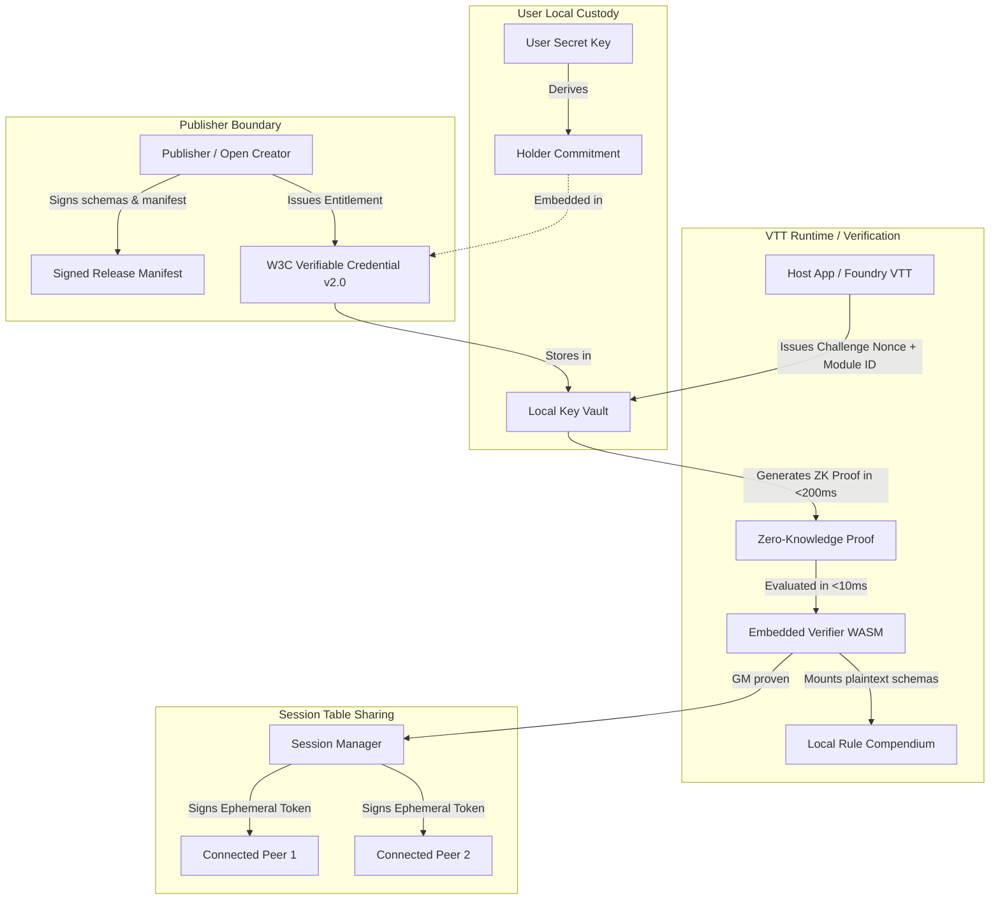
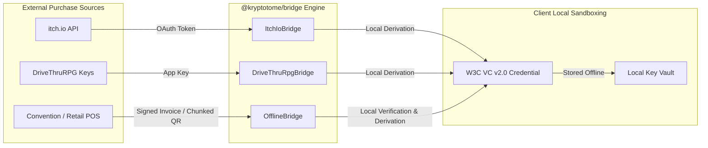
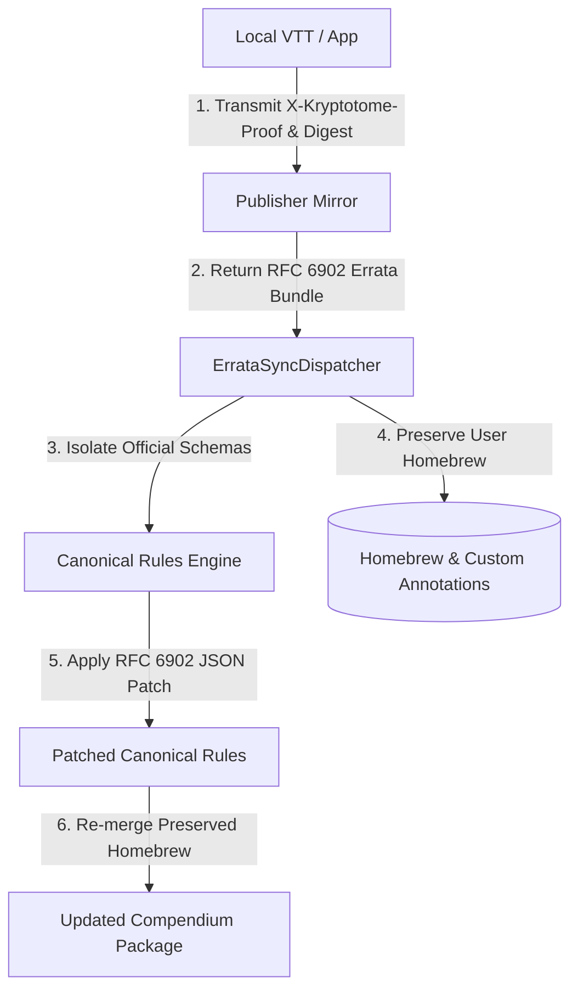
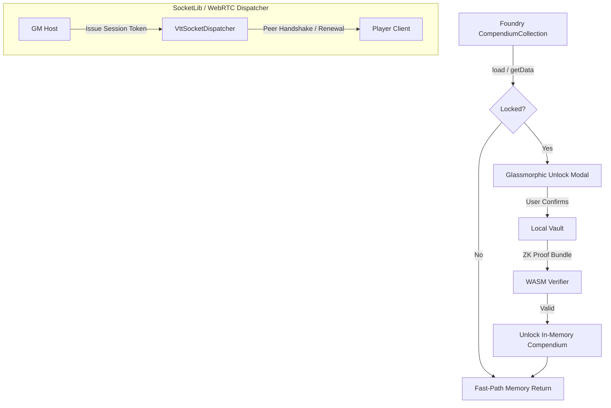

# Kryptotome Protocol: Architectural Specification

## 1. System Vision & Core Philosophy

Kryptotome is a vendor-agnostic, privacy-preserving digital entitlement and content synchronization protocol engineered specifically for the independent tabletop gaming (TTRPG) ecosystem.

### Key Tenets
1. **Decoupled Ownership**: Digital asset purchase is separated from the runtime execution environment. A single verified purchase unlocks content across any compatible software (virtual tabletops, character managers, compendiums).
2. **Strictly Local-First**: Verification executes completely offline inside local client sandboxes (native or WebAssembly). No live authentication clusters, no runtime DRM monitors, and no phone-home telemetry.
3. **No Web3, No Blockchains**: Zero distributed consensus, cryptocurrency tokens, financial ledgers, or smart contracts.
4. **W3C Verifiable Credentials Standard**: Conforms directly to the [W3C Verifiable Credentials Data Model v2.0](https://www.w3.org/TR/vc-data-model-2.0/).
5. **Zero-Knowledge Unlinkability**: Proving ownership of a rulebook module reveals no correlation between separate game sessions, virtual tabletop hosts, or real-world identities.
6. **Physical Table Tradition (Table Sharing)**: Game masters who own a module can authorize connected session peers to access compendium mechanics during a game table session without double-charging players.

---

## 2. Cryptographic Architecture

### 2.1 Cryptographic Primitives
- **Pairing-friendly Elliptic Curves & ZK Arguments**: Arkworks-rs based ZK-SNARK proving system (Groth16 / Plonk) for succinct, sub-10ms verification.
- **Asymmetric Signatures**: Ed25519 for publisher package signatures and host table-sharing session attestations.
- **Deterministic Content Digests**: SHA-256 / BLAKE3 canonical file-tree hashing for open rulebook schemas (ORC, CC SRD 5.1).
- **Holder Commitments**: Pedersen / Poseidon cryptographic commitments binding credentials to local user keys without revealing secrets.

---

## 3. Entitlement & Verification Lifecycle

1. **Package Ingestion & Signing**:
   - The publisher CLI parses open game data directories.
   - Computes deterministic digests of rule schemas.
   - Signs manifest with publisher's asymmetric private key.
2. **Merchant Entitlement Derivation**:
   - Client-side merchant bridge connects to itch.io OAuth API or DriveThruRPG Account Application Keys.
   - Validates purchase locally and derives a W3C VC v2.0 credential.
   - The credential binds the package content digest to the user's secret key commitment.
3. **Application Verification Challenge**:
   - Host software (VTT) generates an ephemeral challenge nonce with expiration (e.g. 60s TTL).
   - Local vault generates a single-use ZK proof satisfying:
     $$\text{Verify}(\text{PK}_{\text{pub}}, \text{ModuleID}, \text{Digest}, \text{Nonce}, \pi) == \text{true}$$
   - The verifier validates $\pi$ in under 10ms and unlocks plaintext JSON/CBOR rule schemas into memory.
4. **Table Sharing**:
   - Game Master proves ownership.
   - GM host signs an ephemeral session attestation for each authenticated peer on the local network or direct P2P link.
   - Connected players mount necessary character classes, spells, and mechanics without purchasing individual duplicate licenses.

---

## 4. Merchant & Offline Bridge Architecture

The `@kryptotome/bridge` package provides ingress bridges from existing merchant platforms and offline environments into cryptographic local custody:

### 4.1 Digital Merchant Bridges
- **itch.io**: Queries `/key/me` and `/key/my-owned-keys` to cross-reference publisher catalog mappings against user purchases.
- **DriveThruRPG**: Uses customer Account Application Keys to query digital library endpoints.
- **Zero Key Egress**: All W3C VC v2.0 credentials are synthesized client-side; user private keys and holder commitments are never transmitted to external APIs.

### 4.2 Air-Gapped & Physical Point-of-Sale Bridges
- **Signed Digital Invoices**: Ed25519-signed digital receipts issued at physical points of sale (retail hobby stores, conventions) with strict temporal validity.
- **Chunked QR Code Transport**: Generates animated, multi-frame QR code streams with CRC/checksum framing, enabling air-gapped cameras to ingest and reassemble entitlements out of order without network connectivity.

---

## 5. Dynamic Errata & Compendium Synchronization

The `@kryptotome/sdk` includes the `ErrataSyncDispatcher` to deliver official rule corrections and balance updates while strictly safeguarding user customizations:

### 5.1 Protocol Headers & Proof Verification
- Clients query publisher mirrors using HTTP `GET` with:
  - `X-Kryptotome-Proof`: Succinct proof verifying legitimate ownership.
  - `X-Kryptotome-Digest`: Current package content digest.
- Mirrors return `304 Not Modified` when current, or an `ErrataPatchBundle` containing RFC 6902 JSON patches.

### 5.2 Homebrew Isolation & Preservation
- Compendium packages frequently contain user homebrew items (`homebrew: true`, `source: 'homebrew'`) and custom modifications (`userNotes`, `custom_*`).
- The patch engine isolates canonical publisher schema structures for RFC 6902 patch operations, leaving user homebrew records and custom fields intact.

---

## 6. Virtual Tabletop (VTT) & Client Integrations

The `@kryptotome/vtt-adapter` package provides native integration with Foundry VTT and other client runtimes:

### 6.1 Compendium Interception Lifecycle
- Hooks Foundry `CompendiumCollection.prototype.load()` and `getData()`.
- Unlocked packages are fast-pathed through an in-memory cache without repeating cryptographic verification.
- Locked compendiums trigger an interactive modal requesting single-use proof generation from the local vault.

### 6.2 Table Sharing Network Protocol
- Uses SocketLib and WebRTC data channels for low-latency peer authorization.
- GM generates ephemeral Ed25519 session tokens bounded by active table session ID, authorized scopes (`rules:read`, `spells:read`), and time-to-live expiration.

---

## 7. Performance Targets & Web Worker Sandboxing

To guarantee 60fps UI responsiveness during gaming sessions, Kryptotome mandates strict performance and resource constraints:

| Metric | Target SLA | Implementation Strategy |
| :--- | :--- | :--- |
| **Proof Verification** | $< 10\text{ ms}$ | Arkworks pairing optimization and native WASM execution. |
| **Proof Generation** | $< 200\text{ ms}$ | Succinct R1CS constraint circuits (`~45-120ms`). |
| **WASM Footprint** | $< 2\text{ MB}$ | Stripped WebAssembly build (`563.6 KB` raw / `250.1 KB` gzip). |
| **Verifier Memory** | $< 16\text{ MB}$ | Bounded verifier memory delta (`< 1 MB`). |
| **Event Loop Isolation** | Non-blocking | `WorkerVerifierBridge` offloads crypto ops to dedicated Web Worker threads. |

