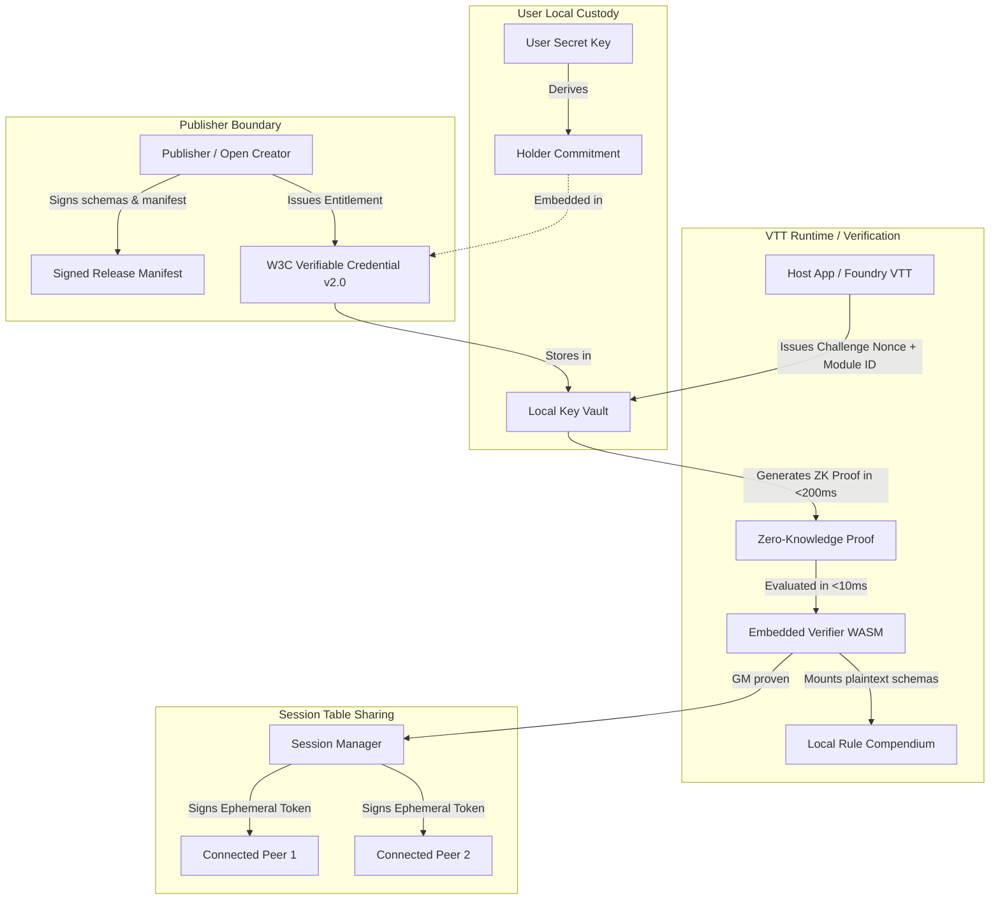

# Kryptotome Protocol: Architectural Specification

## 1. System Vision & Core Philosophy

Kryptotome is a vendor-agnostic, privacy-preserving digital entitlement and content synchronization protocol engineered specifically for the independent tabletop gaming (TTRPG) ecosystem.

### Key Tenets
1. **Decoupled Ownership**: Digital asset purchase is separated from the runtime execution environment. A single verified purchase unlocks content across any compatible software (virtual tabletops, character managers, compendiums).
2. **Strictly Local-First**: Verification executes completely offline inside local client sandboxes (native or WebAssembly). No live authentication clusters, no runtime DRM monitors, and no phone-home telemetry.
3. **No Web3, No Blockchains**: Zero distributed consensus, cryptocurrency tokens, financial ledgers, or smart contracts.
4. **W3C Verifiable Credentials Standard**: Conforms directly to the [W3C Verifiable Credentials Data Model v2.0](https://www.w3.org/TR/vc-data-model-2.0/).
5. **Zero-Knowledge Unlinkability**: Proving ownership of a rulebook module reveals no correlation between separate game sessions, virtual tabletop hosts, or real-world identities.
6. **Physical Table Tradition (Table Sharing)**: Game masters who own a module can authorize connected session peers to access compendium mechanics during a game table session without double-charging players.

---

## 2. Cryptographic Architecture

### 2.1 Cryptographic Primitives
- **Pairing-friendly Elliptic Curves & ZK Arguments**: Arkworks-rs based ZK-SNARK proving system (Groth16 / Plonk) for succinct, sub-10ms verification.
- **Asymmetric Signatures**: Ed25519 for publisher package signatures and host table-sharing session attestations.
- **Deterministic Content Digests**: SHA-256 / BLAKE3 canonical file-tree hashing for open rulebook schemas (ORC, CC SRD 5.1).
- **Holder Commitments**: Pedersen / Poseidon cryptographic commitments binding credentials to local user keys without revealing secrets.

---

## 3. Entitlement & Verification Lifecycle

1. **Package Ingestion & Signing**:
   - The publisher CLI parses open game data directories.
   - Computes deterministic digests of rule schemas.
   - Signs manifest with publisher's asymmetric private key.
2. **Merchant Entitlement Derivation**:
   - Client-side merchant bridge connects to itch.io OAuth API or DriveThruRPG Account Application Keys.
   - Validates purchase locally and derives a W3C VC v2.0 credential.
   - The credential binds the package content digest to the user's secret key commitment.
3. **Application Verification Challenge**:
   - Host software (VTT) generates an ephemeral challenge nonce with expiration (e.g. 60s TTL).
   - Local vault generates a single-use ZK proof satisfying:
     $$\text{Verify}(\text{PK}_{\text{pub}}, \text{ModuleID}, \text{Digest}, \text{Nonce}, \pi) == \text{true}$$
   - The verifier validates $\pi$ in under 10ms and unlocks plaintext JSON/CBOR rule schemas into memory.
4. **Table Sharing**:
   - Game Master proves ownership.
   - GM host signs an ephemeral session attestation for each authenticated peer on the local network or direct P2P link.
   - Connected players mount necessary character classes, spells, and mechanics without purchasing individual duplicate licenses.
